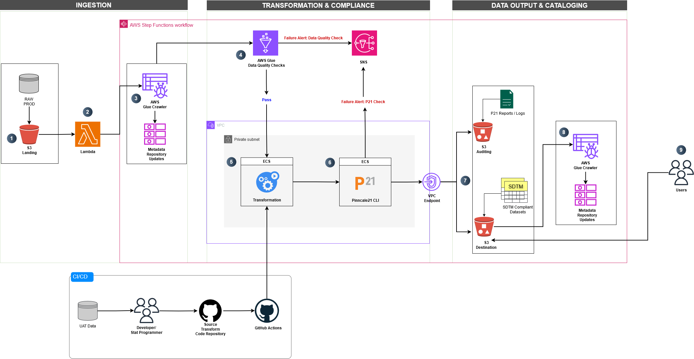

# Automated SDTM Data Pipeline

## Overview

This project presents a design concept for an automated data pipeline tailored for the pharmaceutical and medical device industries. The pipeline transforms raw clinical data from diverse sources—including EDC, EHR, laboratory systems, wearables, manual uploads (e.g., CSVs), and APIs—into CDISC SDTM-compliant datasets. By automating data processing, compliance validation, and output generation, this pipeline streamlines workflows and ensures high-quality, compliant datasets for clinical trials.

---

## Architecture Diagram

---

## Key Features

### AWS Services
The pipeline is built using AWS services to orchestrate data transformation, integration, and processing:
- **S3**: For raw data storage, staging, and final outputs.
- **Step Functions**: To manage and orchestrate the pipeline stages.
- **Glue**: For metadata management, data quality checks, and centralized metadata repository updates.
- **ECS**: To execute transformation and validation scripts.
- **Lambda**: For event-driven workflows and metadata updates.

### Infrastructure as Code
- **Terraform**: Used for provisioning scalable, reusable, and automated infrastructure.
#### Directory Structure
--> insert tree here

### Compliance Validation
- **Pinnacle21 CLI**: Integrated for CDISC compliance checks, ensuring adherence to regulatory standards. Future iterations will address broader regulatory compliance and full domain coverage.

### Metadata Management
- **AWS Glue**: Centralized metadata repository to ensure consistent data lineage and visibility across pipeline stages.

### Error Handling & Data Quality
- Robust error handling and data quality checks ensure reliability.
- Data anonymization is supported to comply with privacy regulations.
- Flexible output formats: CSV, Parquet, SAS7BDAT, and XPT.

### CI/CD
- **GitHub Actions**: Implements CI/CD workflows for automated deployment of transformation scripts to AWS ECS.

---

## High-Level Architecture

### 1. Initial Development Stage
#### Development Workflow
- Developers use UAT data to create and version base transformation scripts in GitHub.
- CI/CD pipelines ensure code updates are deployed to AWS ECS.

#### Code Deployment
- AWS ECS retrieves the latest transformation scripts from GitHub upon deployment.

---

### 2. Pipeline Trigger
#### Raw Data Arrival
- Raw production data is uploaded to a staging S3 bucket.
- An **S3 event notification** triggers an **AWS Lambda** function, which initiates **AWS Step Functions** to start the pipeline.

---

### 3. Data Quality Checks
#### AWS Glue Crawler
- Step Functions trigger an AWS Glue Crawler to crawl raw data and update the centralized metadata repository.

#### Quality Assurance
- AWS Glue Data Quality checks are executed on the raw data:
  - **If checks fail**:
    - Notifications are sent via AWS SNS.
    - Processing stops until issues are resolved.
  - **If checks pass**:
    - The pipeline proceeds to the next stage.

---

### 4. Data Transformation
#### Processing
- Step Functions trigger AWS ECS to execute transformation scripts on the raw data using custom code.

#### Version Control
- ECS tasks dynamically pull the latest version of scripts from GitHub for processing.

---

### 5. Pinnacle21 Compliance Checks
#### Validation
- Step Functions trigger AWS ECS to run Pinnacle21 CLI for CDISC compliance checks on the transformed datasets.

#### Outcome
- **If checks fail**:
  - Notifications are sent via AWS SNS.
  - Logs and reports are stored in the Audit S3 bucket for review.
- **If checks pass**:
  - Compliance reports and logs are saved in the Audit S3 bucket.
  - The pipeline proceeds to the output stage.

---

### 6. Output
#### Final Output
- Step Functions orchestrate the upload of transformed, SDTM-compliant datasets to the output S3 bucket in multiple formats:
  - CSV
  - Parquet
  - SAS7BDAT
  - XPT

---

### 7. Metadata Updates
#### Destination Metadata
- Step Functions trigger an AWS Lambda function to update the metadata repository for the transformed datasets.

---

## Outcome
This design concept lays the foundation for automating data processing and compliance workflows in the pharma and medical device industries. It simplifies operations while ensuring high-quality, compliant datasets that meet CDISC standards.

