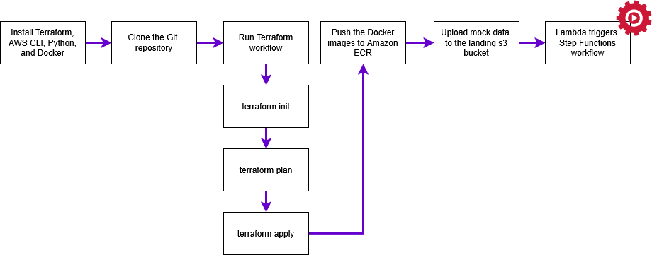

# SDTM Pipeline Prototype - Serverless

**Using:** Step Functions + Custom Scripts  

## Overview

This project is an early-stage, exploratory prototype designed to validate core patterns for a serverless SDTM data pipeline on AWS. While not production-ready, it lays the foundation for a future set of reusable, compliant infrastructure templates — what I call Blueprint as a Service (BaaS).

This pipeline automates the transformation of raw clinical data into CDISC SDTM datasets using AWS-native services. It is built to simulate ingestion from common sources like Electronic Data Capture (EDC) systems, labs, wearables, manual uploads, and APIs.

The focus of this prototype is to:
- Explore cloud-native ETL orchestration patterns (e.g., Step Functions, Lambda, Glue)
- Define modular transformation stages that can be swapped (e.g., Glue → DBT)
- Test infrastructure-as-code deployment via Terraform
- Serve as a launching point for more specialized, production-grade blueprints

>   Note: This is not the final implementation of the BaaS templates. Rather, it’s one of several foundational experiments informing their design.

## 📰 Related Article

This project is part of a larger initiative to rethink clinical data infrastructure through reusable, compliant templates.

Read more:
👉 [Clinical Trial Data Needs a Platform Revolution — Not Just More SDTM Automation](https://medium.com/@mlogan914/clinical-data-needs-a-platform-revolution-not-just-more-automation-71584fd07b63)

## SDTM Context
SDTM (Study Data Tabulation Model) is a standardized format for organizing human clinical trial data. Developed by CDISC (Clinical Data Interchange Standards Consortium), it's used to structure and submit trial data to regulatory agencies like the FDA (Food & Drug Administration) and PMDA (Pharmaceuticals and Medical Devices Agency). SDTM improves data consistency, traceability, and interoperability across studies.

## Tools & Technologies Used:
<div align="center">
  
  
  
  
  
  
  
  
  
  
</div>


---

## Business Scenario:

### Evaluation of Pelvinexinol in Endometriosis (VEXIN-03) - Phase III Clinical Trial
**Objective:**
The VEXIN-03 clinical trial is designed to assess the efficacy and safety of Pelvinexinol, a pain medication for women with endometriosis in the United States. This study evaluates the medication’s impact on pain relief using clinical and Patient-Reported Outcomes (PRO) data. In addition to data collected at study sites, patients will also track key health metrics through external health apps.

### External Application Data Sources  

### 1. Patient-Reported Outcomes (PROs) from External Health Apps (Clue, Flo, MyPainDiary)
#### **Types of Data Collected**
- **Daily pain scores** (1-10 scale, different body areas)  
- **Menstrual cycle tracking** (flow, symptoms, duration)  
- **Mood and fatigue levels**  
- **Medication intake** (NSAIDs, hormonal treatments)  

#### **Privacy Considerations**
- Personally Identifiable Information (PII) risks include:  
  - **Names**  
  - **Emails**  
  - **Timestamps**  
  - **Location data** (if GPS tracking is enabled)

### 2. Wearable Device Data (Fitbit, Apple Health, Oura Ring)  
#### **Types of Data Collected**
- **Resting heart rate** (increases during pain episodes)  
- **Sleep disturbances** (insomnia, frequent awakenings)  
- **Step count & activity levels** (reduced during flare-ups)  

#### **Privacy Considerations**
- Personally Identifiable Information (PII) risks include: 
  - **Device ID**  
  - **User profiles**  
  - **Timestamps**  
  - **GPS coordinates**
  
**Requirements:**
1. **Data Ingestion & Integration** – The pipeline must unify disparate datasets into a single pipeline.
2. **Privacy & De-identification** – Some wearable device data will be excluded from SDTM tables but will need to be accessible to end users (e.g., medical monitors). PII must be masked while preserving raw device data for in-place querying, with granular access controls for different users.
3. **Standardization & Validation** – Site-collected patient data must be standardized across study sites and time points to generate SDTM datasets for clinical analysis using custom scripts.
4. **Data Access & Aggregation** – Statistical programmers and statisticians must be able to easily query and transform trial data to generate ad hoc reports.
5. **Automated Data Processing** – The pipeline should automate data collection, de-identification, transformation, and aggregation while handling updates from multiple study sites.
---
## Architecture Diagram
This pipeline is a fully serverless data processing framework built using AWS services to automate data transformation, integration, and data validation, eliminating infrastructure management while optimizing performance.


---
## Key Features

### Serverless AWS-Based Architecture
- **S3** – Stores raw, staged, final SDTM datasets, complicance reports, and logs.
- **Step Functions** – Orchestrates ingestion & processing, validation, and transformation workflows.
- **Glue** – Manages metadata, enforces data quality checks, and updates centralized metadata repositories.
- **ECS (Fargate)** – Runs SDTM transformation and validation scripts.
- **Lambda** – Handles event-driven workflows, metadata updates, and auxiliary tasks.
- **S3 Object Lambda** – Filters and redacts PII from patient-reported outcomes.
- **CloudWatch** – Provides real-time monitoring, logging, and alerts to track pipeline performance.
- **Athena** – Enables serverless SQL-based querying for end users.

### Infrastructure as Code (IaC)
Terraform — Provisions scalable, reusable, and automated pipeline infrastructure, enabling consistent and repeatable deployments across environments.

### Observability with Datadog
To ensure high observability, proactive issue detection, and streamlined debugging across this serverless architecture, Datadog was integrated into the pipeline.

See the full setup instructions:

📄[Datadog Integration Steps](docs/datadog_integration.md)

### Directory Structure
```
├── docs
├── data                                # Input datasets for pipeline execution
├── docker                              # Docker images and scripts for pipeline tasks
│   ├── transform                       # Transformation logic
│   │   ├── dm.py                       # SDTM transformation script for Demographics (DM)
│   │   ├── dockerfile                  # Dockerfile for the transform task
│   │   └── requirements.txt            # Python dependencies for transformation
│   └── validate                        # Validation logic
│       ├── dockerfile                  # Dockerfile for the validation task
│       └── run_p21.py                  # Example P21 validation script
└── terraform                           # Infrastructure as Code with Terraform
    ├── main.tf                         # Root module
    ├── providers.tf                    # Provider configurations (e.g., AWS)
    ├── terraform.tfvars                # User-defined Terraform variables
    ├── terraform.secrets.auto.tfvars   # Secret values injected at runtime
    ├── terraform.tfstate               # Terraform state file (REDACTED)
    ├── terraform.tfstate.backup        # Backup of the last state (REDACTED)
    ├── variables.tf                    # Shared/global variables
    ├── athena                          # Athena module for querying data
    │   ├── main.tf
    │   └── variables.tf
    ├── datadog                         # Datadog observability and integration
    │   ├── forwarder.tf                # Lambda Forwarder stack configuration
    │   ├── kms.tf                      # KMS config for encrypting Datadog API key
    │   ├── main.tf
    │   ├── providers.tf
    │   ├── roles.tf                    # IAM roles and permissions for Datadog
    │   └── variables.tf
    ├── ecs                             # ECS service module
    │   ├── main.tf
    │   ├── outputs.tf
    │   ├── roles.tf
    │   └── variables.tf
    ├── glue                            # AWS Glue module for data transformation and quality
    │   ├── glue_data_quality.py        # Glue script for data quality checks
    │   ├── main.tf
    │   ├── outputs.tf
    │   ├── roles.tf
    │   └── variables.tf
    ├── lambda                          # AWS Lambda function module
    │   ├── lambda_function.py          # Lambda source code
    │   ├── lambda_function.zip         # Zipped Lambda for deployment
    │   ├── main.tf
    │   ├── outputs.tf
    │   └── roles.tf
    ├── s3                              # S3 buckets and configuration
    │   ├── main.tf
    │   ├── outputs.tf
    │   └── variables.tf
    ├── sns                             # SNS module for notifications
    │   ├── main.tf
    │   └── outputs.tf
    ├── step_functions                  # AWS Step Functions orchestration
    │   ├── main.tf
    │   ├── roles.tf
    │   └── variables.tf
    └── vpc                             # VPC and networking configuration
        ├── main.tf
        └── outputs.tf
```
### Compliance Validation  
- Pinnacle21 (previously known as OpenCDISC) – is a widely used validation tool in the clinical research that provides automated SDTM compliance verification. 
- Pinnacle21 CLI – is integrated for CDISC compliance checks, to ensue SDTM datasets meet regulatory standards for submission.  

#### Platform Limitations & Workarounds  
> ⚠ **Note:** Pinnacle21 CLI **only supports Windows and macOS**, making it incompatible with Linux-based environments. Provisioning a Windows-based VM for validation is an alternative, but it undermines the fully serverless architecture design. A more efficient approach is to run Pinnacle21 on datasets externally from the pipeline.

To bypass this limitation, a placeholder script has been added to simulate a P21 validation run. This can be replaced with a custom validation solution in the future.  

### PII Redaction
When storing clinical datasets in Amazon S3 for use across multiple applications, it’s required to redact sensitive information.

How It Works

S3 Object Lambda Integration – When raw data is requested from S3, an S3 Object Lambda function intercepts the request and applies PII redaction exposing data to the requestor.


You can use the prebuilt Lambda function for PII redaction by attaching it to an S3 Object Lambda Access Point. When an application makes a standard S3 GET request, the access point triggers the Lambda function to detect and redact PII from the data. The redacted data is then returned to the application/requester.

### Metadata Management
**Centralized Data Catalog**

AWS Glue serves as a centralized metadata store, maintaining table schemas, dataset locations, and partitions for optimized queries. It detects and updates schemas dynamically to align with SDTM structures while enforcing schema integrity through validation checks. Glue metadata tables act as checkpoints for tracking pipeline progress and guiding downstream processes. Cataloged data is also queryable in Athena enabling quick validation.

### Error Handling & Data Quality
Errors are logged in CloudWatch, with SNS alerts for critical failures. Data quality checks might include duplicate detection, missing value validation, and range checks, with customization options. Outputs support CSV, Parquet, and XPT for compatibility.

### CI/CD

GitHub Actions automates deployment of transformation scripts to AWS ECS, enabling continuous integration and delivery.

---

## Pipeline Execution Flow

This section outlines the complete flow of the data processing pipeline, from development to data analysis.

---

### 1. Initial Development Stage

#### Development Workflow
- Developers work with UAT data to build and version transformation scripts.
- Scripts are maintained in GitHub to enable version control and collaboration.
- CI/CD pipelines automate deployment of updated scripts to AWS ECS.

#### Code Deployment
- Upon deployment, AWS ECS tasks pull the latest transformation scripts from GitHub.

---

### 2. Pipeline Trigger

#### Raw Data Arrival
- Raw production data is uploaded to a staging S3 bucket.
- An S3 event notification triggers an AWS Lambda function.
- The Lambda function initiates a workflow managed by AWS Step Functions.

---

### 3. Data Quality Checks

#### Metadata Crawling
- Step Functions trigger an AWS Glue Crawler to scan and catalog raw data.
- Metadata is registered in the centralized AWS Glue Data Catalog.

#### Quality Assurance
- AWS Glue Data Quality checks are executed on the raw data.
- If checks fail:
  - Alerts are sent via Amazon SNS.
  - Pipeline execution is paused until issues are resolved.
- If checks pass:
  - The pipeline continues to the transformation stage.

---

### 4. Data Transformation

#### Processing
- Step Functions trigger an AWS ECS task to execute transformation scripts on the raw data.

#### Version Control
- The ECS task ensures the most recent script versions from GitHub are used during processing.

---

### 5. Pinnacle21 Compliance Checks

#### Validation
- Step Functions invoke an ECS task that runs the Pinnacle21 CLI to check for CDISC SDTM compliance.

#### Outcome
- If checks fail:
  - Notifications are sent via SNS.
  - Compliance logs and reports are saved in the Audit S3 bucket.
- If checks pass:
  - Reports and logs are saved for audit.
  - Pipeline proceeds to output generation.

---

### 6. Output

#### Final Output
- Step Functions coordinate the upload of SDTM-compliant datasets to the output S3 bucket.
- Output formats include:
  - CSV
  - Parquet
  - XPT

---

### 7. Metadata Updates

#### Destination Metadata
- An AWS Lambda function updates the metadata repository for the transformed datasets.

---

### 8. Data Analysis & Validation

#### Athena Querying
- Amazon Athena provides SQL-based, serverless querying over transformed SDTM datasets.
- End users such as biostatisticians and statistical programmers can:
  - Validate data accuracy and structure
  - Check compliance status
  - Generate analysis reports

---

### 9. Data Access and PII Redaction (External to Step Functions)

#### S3 Object Lambda
- Wearable application data is ingested via custom scripts into an S3 bucket.
- When accessed, S3 Object Lambda dynamically:
  - Filters the response
  - Redacts personally identifiable information (PII)
  - Delivers a privacy-compliant version of the data


---

## Pipeline Deployment

---

## Step Functions Workflow


---

## Outcome
This design concept lays the foundation for automating data processing and compliance workflows in the pharma and medical device industries. It simplifies operations while ensuring high-quality, compliant datasets that meet CDISC standards.