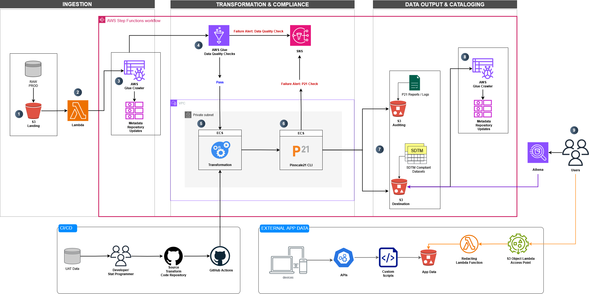
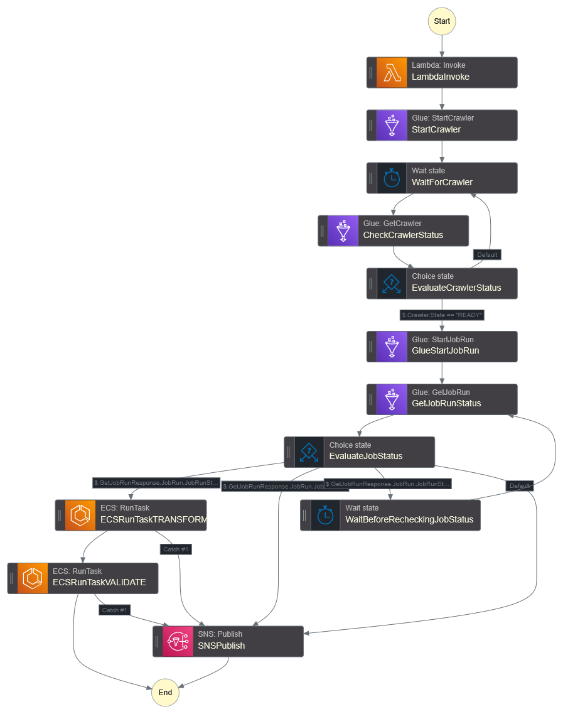

# Automated SDTM Data Pipeline

## Overview
SDTM (Study Data Tabulation Model) is a standardized format developed by CDISC (Clinical Data Interchange Standards Consortium) for organizing and submitting clinical trial data to regulatory agencies such as the FDA and PMDA. It enhances consistency, traceability, and interoperability across studies.

This project presents a *minimally viable pipeline* for automating SDTM-compliant data transformation in the pharmaceutical and medical device industries. The pipeline ingests raw clinical data from diverse sources—including Electronic Data Capture (EDC), laboratory systems, wearable devices, uploads, and APIs—and processs it into CDISC SDTM datasets.

---

## Architecture Diagram
This pipeline is a fully serverless data processing framework built using AWS services to automate data transformation, integration, and validation for clinical trial data, eliminating infrastructure management while optimizing performance.


---

## Key Features

### Serverless AWS-Based Architecture
- `S3 Object Lambda` – Filters and redacts PII from patient-reported outcomes before ingestion.
- `S3` – Stores raw, staged, and final SDTM datasets, output complicance reports and logs.
- `Step Functions` – Orchestrates ingstion & processing, validation, and transformation workflows.
- `Glue` – Manages metadata, enforces data quality checks, and updates centralized metadata repositories.
- `ECS` (Fargate) – Runs SDTM transformation and validation scripts.
- `Lambda` – Handles event-driven workflows, metadata updates, and auxiliary tasks.
- `CloudWatch` – Provides real-time monitoring, logging, and alerts to track pipeline performance.
- `Athena` – Enables serverless SQL-based querying for end users.

### Infrastructure as Code (IaC)
- `Terraform`: Used for provisioning scalable, reusable, and automated pipeline infrastructure.

#### Directory Structure
```
├── docker                          # Docker configurations for transform and validate
│   ├── transform                   # Transformation scripts and Docker configurations
│   │   ├── dm.py                   # Data transformation script
│   │   ├── dockerfile              # Dockerfile for building the transformation container
│   │   └── requirements.txt        # Python dependencies for transformation process
│   └── validate                    # Validation scripts and Docker configuration
│       ├── dockerfile              # Dockerfile for the validation container
│       └── run_p21.py              # Script to run data validation
├── raw_dm.csv                      # Raw data file for testing and validation
└── terraform                       # Terraform configurations for provisioning AWS resources
    ├── ecs                         # ECS-related infrastructure configuration
    │   ├── main.tf                 # ECS configuration
    │   ├── roles.tf                # IAM roles for ECS
    │   └── variables.tf            # ECS-related variables
    ├── glue                        # AWS Glue infrastructure and data quality scripts
    │   ├── glue_data_quality.py    # Data quality check script for Glue
    │   ├── main.tf                 # Glue configuration
    │   ├── outputs.tf              # Glue outputs
    │   ├── roles.tf                # IAM roles for Glue
    │   └── variables.tf            # Glue-related variables
    ├── lambda                      # Lambda functions and configuration
    │   ├── lambda_function.py      # Lambda function code
    │   ├── lambda_function.zip     # Zipped Lambda function for deployment
    │   ├── main.tf                 # Lambda infrastructure configuration
    │   └── roles.tf                # IAM roles for Lambda
    ├── main.tf                     # Main Terraform configuration
    ├── providers.tf                # AWS provider configurations for Terraform
    ├── s3                          # S3-related infrastructure configuration
    │   ├── main.tf                 # S3 infrastructure configuration
    │   ├── outputs.tf              # S3 outputs
    │   └── variables.tf            # S3-related variables
    ├── sns                         # SNS infrastructure configuration
    │   └── main.tf                 # SNS configuration
    ├── step_functions              # AWS Step Functions infrastructure configuration
    │   ├── main.tf                 # Step Functions configuration
    │   ├── roles.tf                # IAM roles for Step Functions
    │   └── variables.tf            # Step Functions-related variables
    └── vpc                         # VPC-related infrastructure configuration
        ├── main.tf                 # VPC configuration
        └── outputs.tf              # VPC outputs
```
### Compliance Validation  

- `Pinnacle21 CLI` is integrated for **CDISC compliance checks**, ensuring SDTM datasets meet regulatory standards for submission to agencies like the **FDA and PMDA**.  
- `Pinnacle21 (formerly OpenCDISC)` is a widely used validation tool in the clinical research industry, providing automated **SDTM compliance verification**.  

#### Platform Limitations & Workarounds  
> ⚠ **Note:** Pinnacle21 CLI **only supports Windows and macOS**, making it incompatible with Linux-based environments.  

- To bypass this limitation, a placeholder script has been added to simulate a P21 validation run. This can be replaced with a custom validation solution in the future.  
- A possible alternative is provisioning a Windows-based VM for validation, but this may introduce unnecessary infrastructure overhead.  
- A more efficient approach is to run Pinnacle21 on output datasets externally from the pipeline.   

### Metadata Management
- `AWS Glue Centralized metadata repository`- Used to ensure consistent data lineage and visibility across pipeline stages.

### Error Handling & Data Quality
`Basic Error Handling`: The pipeline includes basic error handling mechanisms, ensuring that issues are caught and logged for further review. Errors are routed to CloudWatch for easy monitoring, and SNS notifications are triggered to alert the team when critical failures occur. While this approach is simple, it provides a solid foundation for scaling up error management in future iterations.

`Data Quality Checks`: Supports data validation at ingestion to ensure integrity. This includes duplicate detection, missing value checks, and range validation, guaranteeing that the data meets data quality rules before transformation.  While these checks ensure that data integrity is maintained at a foundational level, the pipeline is designed to be easily customized and expanded for more robust validation checks as needed in the future. This allows for the inclusion of more complex quality controls as the pipeline scales.

`Data Anonymization`: The pipeline supports anonymization of sensitive data, ensuring that personally identifiable information (PII) is removed to comply with privacy regulations like HIPAA and GDPR. This helps mitigate risks associated with handling healthcare data and maintains privacy across all stages of processing.

`Flexible Output Formats`: Processed datasets are available in a variety of output formats including CSV, Parquet, and XPT to ensure compatibility with downstream systems and tools.

### CI/CD
- `GitHub Actions`: Implements CI/CD workflows for automated deployment of transformation scripts to AWS ECS.

---

## Step Functions Workflow


## High-Level Architecture

### 1. Initial Development Stage
#### Development Workflow
- Developers use UAT data to create and version base transformation scripts in GitHub.
- CI/CD pipelines ensure code updates are deployed to AWS ECS.

#### Code Deployment
- AWS ECS retrieves the latest transformation scripts from GitHub upon deployment.

---

### 2. Pipeline Trigger
#### Raw Data Arrival
- Raw production data is uploaded to a staging S3 bucket.
- An **S3 event notification** triggers an **AWS Lambda** function, which initiates **AWS Step Functions** to start the pipeline.

---

### 3. Data Quality Checks
#### AWS Glue Crawler
- Step Functions trigger an AWS Glue Crawler to crawl raw data and update the centralized metadata repository.

#### Quality Assurance
- AWS Glue Data Quality checks are executed on the raw data:
  - **If checks fail**:
    - Notifications are sent via AWS SNS.
    - Processing stops until issues are resolved.
  - **If checks pass**:
    - The pipeline proceeds to the next stage.

---

### 4. Data Transformation
#### Processing
- Step Functions trigger AWS ECS to execute transformation scripts on the raw data using custom code.

#### Version Control
- ECS tasks pull the latest version of scripts from GitHub for processing.

---

### 5. Pinnacle21 Compliance Checks
#### Validation
- Step Functions trigger AWS ECS to run Pinnacle21 CLI for CDISC compliance checks on the transformed datasets.

#### Outcome
- **If checks fail**:
  - Notifications are sent via AWS SNS.
  - Logs and reports are stored in the Audit S3 bucket for review.
- **If checks pass**:
  - Compliance reports and logs are saved in the Audit S3 bucket.
  - The pipeline proceeds to the output stage.

---

### 6. Output
#### Final Output
- Step Functions orchestrate the upload of transformed, SDTM-compliant datasets to the output S3 bucket in multiple formats:
  - CSV
  - Parquet
  - XPT

---

### 7. Metadata Updates
#### Destination Metadata
- Step Functions trigger an AWS Lambda function to update the metadata repository for the transformed datasets.

---

## Outcome
This design concept lays the foundation for automating data processing and compliance workflows in the pharma and medical device industries. It simplifies operations while ensuring high-quality, compliant datasets that meet CDISC standards.

