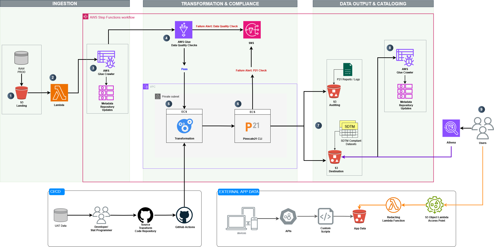

# Automated SDTM Data Pipeline on AWS - Serverless

## Overview

SDTM (Study Data Tabulation Model) is a standardized structure for human clinical trial data tabulations developed by CDISC (Clinical Data Interchange Standards Consortium) for organizing and submitting clinical trial data to regulatory agencies such as the FDA and PMDA. It enhances consistency, traceability, and interoperability across studies.

This project presents a minimally viable pipeline for automating SDTM-compliant data transformation in the pharmaceutical and medical device industries. The pipeline ingests raw clinical data from diverse sources—including Electronic Data Capture (EDC), laboratory systems, wearable devices, manual uploads, and APIs—and processes it into CDISC SDTM datasets.

---

## Architecture Diagram
This pipeline is a fully serverless data processing framework built using AWS services to automate data transformation, integration, and validation of data, eliminating infrastructure management while optimizing performance.


---
## Key Features

### Serverless AWS-Based Architecture
- `S3 Object Lambda` – Filters and redacts PII from patient-reported outcomes before ingestion.
- `S3` – Stores raw, staged, final SDTM datasets, complicance reports, and logs.
- `Step Functions` – Orchestrates ingestion & processing, validation, and transformation workflows.
- `Glue` – Manages metadata, enforces data quality checks, and updates centralized metadata repositories.
- `ECS` (Fargate) – Runs SDTM transformation and validation scripts.
- `Lambda` – Handles event-driven workflows, metadata updates, and auxiliary tasks.
- `CloudWatch` – Provides real-time monitoring, logging, and alerts to track pipeline performance.
- `Athena` – Enables serverless SQL-based querying for end users.

### Infrastructure as Code (IaC)
- `Terraform`: Used for provisioning scalable, reusable, and automated pipeline infrastructure.

#### Directory Structure
```
├── docker                          # Docker configurations for transform and validate
│   ├── transform                   # Transformation scripts and Docker configurations
│   │   ├── dm.py                   # Data transformation script
│   │   ├── dockerfile              # Dockerfile for building the transformation container
│   │   └── requirements.txt        # Python dependencies for transformation process
│   └── validate                    # Validation scripts and Docker configuration
│       ├── dockerfile              # Dockerfile for the validation container
│       └── run_p21.py              # Script to run data validation
├── raw_dm.csv                      # Raw data file for testing and validation
└── terraform                       # Terraform configurations for provisioning AWS resources
    ├── ecs                         # ECS-related infrastructure configuration
    │   ├── main.tf                 # ECS configuration
    │   ├── roles.tf                # IAM roles for ECS
    │   └── variables.tf            # ECS-related variables
    ├── glue                        # AWS Glue infrastructure and data quality scripts
    │   ├── glue_data_quality.py    # Data quality check script for Glue
    │   ├── main.tf                 # Glue configuration
    │   ├── outputs.tf              # Glue outputs
    │   ├── roles.tf                # IAM roles for Glue
    │   └── variables.tf            # Glue-related variables
    ├── lambda                      # Lambda functions and configuration
    │   ├── lambda_function.py      # Lambda function code
    │   ├── lambda_function.zip     # Zipped Lambda function for deployment
    │   ├── main.tf                 # Lambda infrastructure configuration
    │   └── roles.tf                # IAM roles for Lambda
    ├── main.tf                     # Main Terraform configuration
    ├── providers.tf                # AWS provider configurations for Terraform
    ├── s3                          # S3-related infrastructure configuration
    │   ├── main.tf                 # S3 infrastructure configuration
    │   ├── outputs.tf              # S3 outputs
    │   └── variables.tf            # S3-related variables
    ├── sns                         # SNS infrastructure configuration
    │   └── main.tf                 # SNS configuration
    ├── step_functions              # AWS Step Functions infrastructure configuration
    │   ├── main.tf                 # Step Functions configuration
    │   ├── roles.tf                # IAM roles for Step Functions
    │   └── variables.tf            # Step Functions-related variables
    └── vpc                         # VPC-related infrastructure configuration
        ├── main.tf                 # VPC configuration
        └── outputs.tf              # VPC outputs
```
### Compliance Validation  
- `Pinnacle21 (formerly OpenCDISC)` is a widely used validation tool in the clinical research industry, providing automated SDTM compliance verification. 
- `Pinnacle21 CLI` is integrated for CDISC compliance checks, to ensue SDTM datasets meet regulatory standards for submission.  

#### Platform Limitations & Workarounds  
> ⚠ **Note:** Pinnacle21 CLI **only supports Windows and macOS**, making it incompatible with Linux-based environments.  

- To bypass this limitation, a placeholder script has been added to simulate a P21 validation run. This can be replaced with a custom validation solution in the future.  
- Provisioning a Windows-based VM for validation is an alternative, but it undermines the fully serverless architecture by reintroducing infrastructure overhead and management. 
- A more efficient approach is to run Pinnacle21 on datasets externally from the pipeline.   

### PII Redaction
When storing clinical datasets in Amazon S3 for use across multiple applications, it’s required to redact sensitive information. For example, before processing patient-reported data, PII should be removed to comply with privacy regulations such as HIPPA and GDPR.

How It Works

`S3 Object Lambda Integration`: When raw data is requested from S3, an S3 Object Lambda function intercepts the request and applies PII redaction before passing the data to the pipeline.


You can use the prebuilt Lambda function for PII redaction by attaching it to an S3 Object Lambda Access Point. When an application makes a standard S3 GET request, the access point triggers the Lambda function to detect and redact PII from the data. The redacted data is then returned to the application.

### Metadata Management
`AWS Glue Centralized Metadata Repository`

1. Centralized Data Catalog
  - AWS Glue stores metadata in the AWS Glue Data Catalog, which acts as a central repository for:
    - Table and schema definitions (e.g., column names, data types).
    - Locations of raw and transformed datasets (S3 paths).
    - Partition information for optimizing queries in Athena.

2. Schema Management
  - Automatically detects schemas from raw clinical data sources.
  - Updates schema information dynamically when new data arrives.
  - Ensures that transformations align with expected SDTM structures.

3. Data Quality & Validation
  - Helps enforce schema validation by detecting missing or unexpected fields.
  - Enables duplicate detection and record integrity checks before transformation.

4. Querying & Analysis (Athena Integration)
  - Once data is cataloged, Amazon Athena can query it directly using SQL, without requiring additional transformations.
  - This allows for quick validation and compliance checks before submission.

5. Pipeline Orchestration
  - Glue metadata tables act as intermediary checkpoints for tracking progress between pipeline stages.
  - Downstream processes (e.g., ECS transformations, Pinnacle21 validation) can refer to Glue tables instead of raw files.

### Error Handling & Data Quality

- `Error Handling`: Logs issues in CloudWatch and triggers SNS notifications for critical failures. Provides a foundation for scaling error management. 
- `Data Quality Checks`: Supports duplicate detection, missing value checks, and range validation at ingestion, with flexibility for customization and expansion.
- Output Formats: Supports CSV, Parquet, and XPT for broad compatibility.

### CI/CD
- `GitHub Actions`: Implements CI/CD workflows for automated deployment of transformation scripts to AWS ECS.
---
## Pipeline Execution Flow

### `1. Initial Development Stage`
#### Development Workflow
- Developers use UAT data to create and version base transformation scripts in GitHub.
- CI/CD pipelines ensure code updates are deployed to AWS ECS.

#### Code Deployment
- AWS ECS retrieves the latest transformation scripts from GitHub upon deployment.
---
### `2. Pipeline Trigger`
#### Raw Data Arrival
- Raw production data is uploaded to a staging S3 bucket.
- An **S3 event notification** triggers an **AWS Lambda** function, which initiates **AWS Step Functions** to start the pipeline.
---
### `3. PII Redaction (Pre-Ingestion)`
#### S3 Object Lambda
- S3 Object Lambda is invoked to filter and redact PII from patient-reported data before ingestion.
- The redacted data is then stored in a cleaned S3 bucket.
- Once processed, the pipeline proceeds to the next stage.
---
### `4. Data Quality Checks`
#### AWS Glue Crawler
- Step Functions trigger an AWS Glue Crawler to crawl raw data and update the centralized metadata repository.

#### `Quality Assurance`
- AWS Glue Data Quality checks are executed on the raw data:
- **If checks fail**:
  - Notifications are sent via AWS SNS.
  - Processing stops until issues are resolved.
- **If checks pass**:
  - The pipeline proceeds to the next stage.
---
### `5. Data Transformation`
#### Processing
- Step Functions trigger AWS ECS to execute transformation scripts on the raw data using custom code.

#### Version Control
- ECS tasks pull the latest version of scripts from GitHub for processing.
---
### `6. Pinnacle21 Compliance Checks`
#### Validation
- Step Functions trigger AWS ECS to run Pinnacle21 CLI for CDISC compliance checks on the transformed datasets.

#### Outcome
- **If checks fail**:
  - Notifications are sent via AWS SNS.
  - Logs and reports are stored in the Audit S3 bucket for review.
- **If checks pass**:
  - Compliance reports and logs are saved in the Audit S3 bucket.
  - The pipeline proceeds to the output stage.
---
### `7. Output`
#### Final Output
- Step Functions orchestrate the upload of transformed, SDTM-compliant datasets to the output S3 bucket in multiple formats:
  - CSV
  - Parquet
  - XPT
---
### `8. Metadata Updates`
#### Destination Metadata
- Step Functions trigger an AWS Lambda function to update the metadata repository for the transformed datasets.

### `9. Data Analysis & Validation`
#### Querying with Athena
- Amazon Athena is used to perform serverless SQL-based queries on the transformed SDTM datasets.
- End users (e.g., biostatisticians, statistical programmers etc.,) can validate data integrity, check compliance, and generate reports.
---
## Step Functions Workflow


## Outcome
This design concept lays the foundation for automating data processing and compliance workflows in the pharma and medical device industries. It simplifies operations while ensuring high-quality, compliant datasets that meet CDISC standards.
